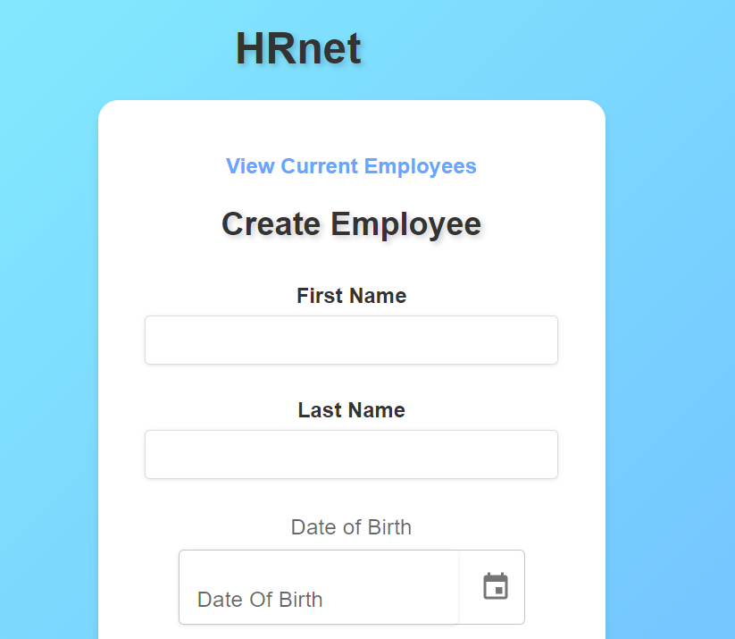

# HRNet



## About The Project

HRNet is an internal web application for managing company employees. Built with React, it allows the creation and viewing of employee records, with advanced filtering and sorting options for simplified management.

Key Features:

Create new employee records via a complete form.
View the employee list.
Filter and sort employees by various criteria (name, department, etc.).
Custom modal for action confirmations (employee creation).
Modern and responsive user interface with Material UI (MUI).
Here’s why this project was built:

Simplify employee management in one place.
Provide a smooth and responsive user interface.

## Built With

This application was built using the following technologies:

React
Redux (State management)
Material UI (UI component framework)
npm (Package manager)
React Router (Navigation)

## Getting Started

To get a local copy up and running, follow these simple steps.

Prerequisites
Make sure you have npm installed on your machine. If not, you can install it [here](https://docs.npmjs.com/getting-started).

### Installation

Clone the repository:

```bash
git clone https://github.com/votre-repo/hrnet.git
```

Navigate to the project directory:

```bash

cd hrnet
```

Install npm dependencies:

```bash

npm install
```

Start the application:

```bash

npm start
```

## Usage

To use the application, follow these instructions:

Go to the "Create Employee" page.
Fill out the form with the employee’s information.
Submit the form to add the employee to the list.
Navigate to the "Employee List" page to view, sort, and filter existing employees.

## Roadmap

 Creation of the employee form

 Integration of Redux for state management

 Addition of a modal to confirm employee creation

 Performance improvements with Lighthouse
